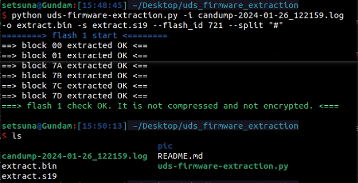

# uds-firmware-extraction
A firmware extraction tool which extracts firmware from UDS flash traffic.

Author: Honinbon

## Intro
The tool is used to extract ECU firmware from UDS flash traffic, which is under the standard specification ISO-14229.

## Usage
```
usage: uds-firmware-extraction.py [-h] -i input_file [-o output_file] [-s s19_file] --flash_id flash_id [--split split_symble] [-v]

Author: Honinbon
UDS flash traffic firmware extraction tool.

options:
  -h, --help                show this help message and exit
  -i input_file, --input input_file
                            Standard candump logfile
  -o output_file, --output output_file
                            File to store the extracted firmware. default: firmware.bin
  -s s19_file, --s19 s19_file
                            Generate a firmware.s19 at the same time
  --flash_id flash_id       Diag id used for flashing
  --split split_symble      The specified symble to split canid and candata in the input file. default: "#"
  -v, --version             Display version
```
Examples:    


## License
GNU General Public License v2.0